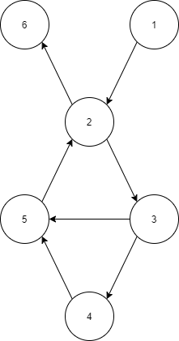

# Chapter 7 - Section 2 - Subsection 3 - Exercise 1

## Graph I

### (a)

### (b)
DU-paths of given graph:

[1,2,8], [1,2,3,5,6], [4,3,5,6], [4,3,5,7,2,8], [4,3,5,6,7,2,8]

### (c)

t1 = [1,2,8]
t2 = [1,2,3,5,7,2,8]
t3 = [1,2,3,5,6,7,2,8] 
t4 = [1,2,3,4,3,5,7,2,8]
t5 = [1,2,3,4,3,4,3,5,6,7,2,8]
t6 = [1,2,3,4,3,5,7,2,3,5,6,7,2,8]

| Test path | DU-paths covered                          |
|----------:|-------------------------------------------|
| t1        | [1,2,8]                                   |
| t2        | [1,2,8]                                   |
| t3        | [1,2,8], [1,2,3,5,6]                      |
| t4        | [4,3,5,7,2,8]                             |
| t5        | [4,3,5,6], [4,3,5,6,7,2,8]                |
| t6        | [4,3,5,6], [4,3,5,7,2,8], [4,3,5,6,7,2,8] |

### (d)
{t3, t5} would be enough to cover All-Defs coverage

### (e)
{t1, t3, t5} would be enough to cover All-Uses coverage

### (f)
{t1,t3,t4,t5} would be enough to cover All-Du-Paths Coverage

## Graph II

### (a)

### (b)
DU-paths of given graph:
[1,2,6], [1,2,3], [3,5,2,3], [3,5,2,6], [3,4,5,2,3], [3,4,5,2,6]

### (c)

t1 = [1,2,6]
t2 = [1,2,3,4,5,2,3,5,2,6]
t3 = [1,2,3,5,2,3,4,5,2,6] 
t4 = [1,2,3,5,2,6]

| Test path | DU-paths covered                          |
|----------:|-------------------------------------------|
| t1        | [1,2,6]                                   |
| t2        | [1,2,3], [3,4,5,2,3], [3,5,2,6]           |
| t3        | [1,2,3], [3,5,2,3], [3,4,5,2,6]           |
| t4        | [1,2,3], [3,5,2,6]                        |

### (d)
{t4} would be enough to cover All-Defs coverage

### (e)
{t1,t2} would be enough to cover All-Uses coverage

### (f)
{t1, t2, t3} would be enough to cover All-Du-Paths Coverage

## Graph III

### (a)
This graph is basically the same as Graph II but with different def-use pairs

### (b)
DU-paths of given graph:

[1,2,6], [1,2,3], [1,2,3,5], [4,5], [4,5,2,3], [4,5,2,6] 

### (c)

t1 = [1,2,3,5,2,6]
t2 = [1,2,3,4,5,2,6]

| Test path | DU-paths covered            |
|----------:|-----------------------------|
| t1        | [1,2,3], [1,2,3,5], [1,2,6] |
| t2        | [1,2,3], [4,5], [4,5,2,6]   |

### (d)
{t1} would be enough to cover All-Defs coverage

### (e)
{t1,t2, [1,2,6],[1,2,3,4,5,2,3,5,2,6]} would be enough to cover All-Uses coverage (Direct tour)

### (f)
{t1,t2, [1,2,6],[1,2,3,4,5,2,3,5,2,6]} would also be enough to cover All-DU-Paths Coverage

## Graph IV

### (a)
This graph is basically the same as Graph II but with different def-use pairs

### (b)
DU-paths of given graph:
[1,2,6], [1,2,3,5], [1,2,3,4,5], [5,2,6], [5,2,3,5], [5,2,3,4,5]

### (c)

t1 = [1,2,6]
t2 = [1,2,3,4,5,2,3,5,2,6]
t3 = [1,2,3,5,2,3,4,5,2,6] 

| Test path | DU-paths covered                           |
|----------:|--------------------------------------------|
| t1        | [1,2,6]                                    |
| t2        | [1,2,3,4,5], [5,2,3,5], [5,2,6]            |
| t3        | [1,2,3,5], [5,2,3,4,5], [5,2,6]            |

### (d)
{t2} would be enough to cover All-Defs coverage

### (e)
{t1, t2} would be enough to cover All-Uses coverage

### (f)
{t1, t2, t3} would be enough to cover All-DU-Paths coverage