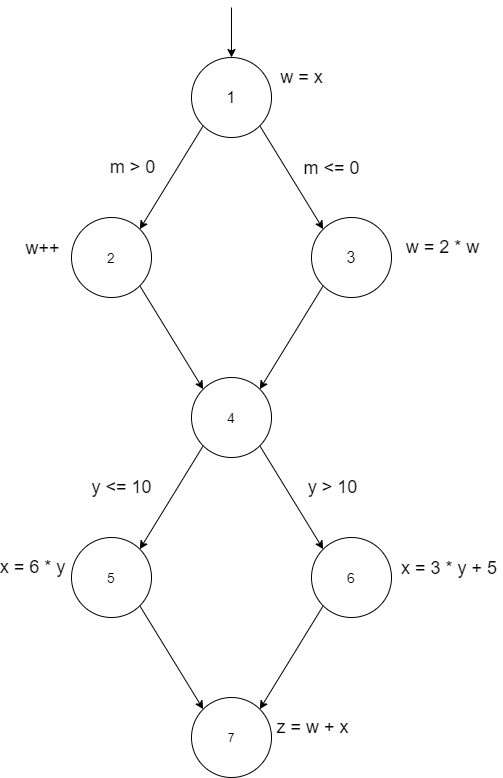

# Chapter 7 - Section 3 - Exercise 1

```Java
w = x; // node 1
if (m > 0)
{
w++; // node 2
}
else
{
w=2*w; // node 3
}
// node 4 (no executable statement)
if (y <= 10)
{
x = 5*y; // node 5
}
else
{
x = 3*y+5; // node 6
}
z = w + x; // node 7
```

## (a) Draw a control flow graph for this program fragment. Use the node numbers given above.



## (b) Which nodes have defs for variable w?
Nodes *1*, *2*, *3* have defs for variable *w*

## (c) Which nodes have uses for variable w?
Nodes *2*, *3*, *7* have uses for variable *w*

## (d) Are there any du-paths with respect to variable w from node 1 to node 7? If not, explain why not. If any exist, show one.
There are no def-clear path from node 1 to node 7 with respect to varianle w since defs at node 2 and 3 are in the way of the def in node 1

## (e) List all of the du-paths for variables w and x.

### Du-paths for variable *w*:
- [1,2]
- [1,3]
- [2,4,5,7]
- [2,4,6,7]
- [3,4,5,7]
- [3,4,6,7]

### Du-paths for variable *x*
- [5,7]
- [6,7]