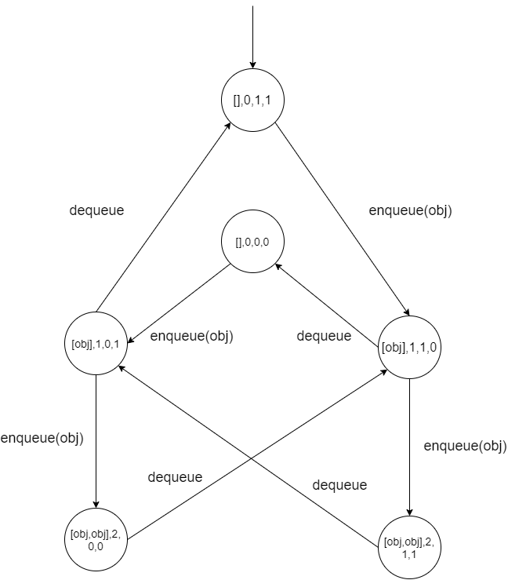

# Chapter 7 - Section 5 - Exercise 1

## Question
Use the class BoundedQueue2 for questions a–f below. A compilable version is available on the book website in the file BoundedQueue2.java. The queue is managed in the usual circular fashion.  
Suppose we build an FSM where states are defined by the representation variables of BoundedQueue2. That is, a state is a 4- tuple defined by the values for [elements, size, front, back]. For example, the initial state has the value [[null, null], 0, 0, 0], and the state that results from pushing an object obj onto the queue in its initial state is [[obj, null], 1, 0, 1].


```Java
// Introduction to Software Testing
// Authors: Paul Ammann & Jeff Offutt
// Chapter 7, page ??
// No JUnit tests at this time

public class BoundedQueue2
{ 
   // Overview:  a BoundedQueue2 is a mutable, bounded FIFO data structure
   // of fixed size , with size being fixed at 2.
   // A typical Queue is [], [o1], or [o1, o2], where neither o1 nor o2
   // are ever null.  Older elements are listed before newer ones.

   private final Object[] elements;
   private int size, front, back;
   private final int CAPACITY = 2;

   public BoundedQueue2 ()
   {
      elements = new Object [CAPACITY];
      size  = 0; front = 0; back  = 0;
   }

   public void enQueue (Object o)
      throws NullPointerException, IllegalStateException
   {  // Modifies: this
      // Effects:   If argument is null throw NullPointerException
      // else if this is full, throw IllegalStateException,
      // else make o the newest element of this
      if (o == null)
         throw new NullPointerException ("BoundedQueue2.enQueue");
      else if (size == CAPACITY)
         throw new IllegalStateException ("BoundedQueue2.enQueue");
      else
      {
         size++;
         elements [back] = o;
         back = (back+1) % CAPACITY;
      }
   }
   
   public Object deQueue () throws IllegalStateException
   {  // Modifies: this
      // Effects:   If queue is empty, throw IllegalStateException,
      // else remove and return oldest element of this
   
      if (size == 0)
         throw new IllegalStateException ("BoundedQueue2.deQueue");
      else
      {
         size--;
         Object o = elements [ (front % CAPACITY) ];
         elements [front] = null;
         front = (front+1) % CAPACITY;
         return o;
      }
   }
   
   public boolean isEmpty()
   { 
      return (size == 0); 
   }
   public boolean isFull() 
   { 
      return (size == CAPACITY); 
   }
   
   public String toString()
   {
      String result = "[";
      for (int i = 0; i < size; i++)
      {
         result += elements[ (front + i) % CAPACITY ] . toString();
         if (i < size -1) {
            result += ", ";
         }
      }
      result += "]";
      return result;
   }
   
}
```
### We do not care which specific objects are in the queue. Consequently, there are really just four useful values for the variable elements. What are they?
4 useful values of the variable *elements* are:  
[object, object], [object, null], [null, object], [null, null]

### How many states are there?
Since *elements* has 4 states, *size* has 3 states (0,1,2), *front* and *back* each has 2 states, there are a total of 4 * 3 * 2 * 2 = 48 states.

### How many of these states are reachable ?
Out of 48 total states, only 6 of them are reachable. These 6 will be listed in part (d).

### Show the reachable states in a drawing.
**Note** : Question *(e)* is also done here.   


### Define a small test set that achieves Edge Coverage. Implement and execute this test set. You might find it helps to write a method that shows the internal variables at each call.
The following function calls would achieve Edge coverage:
```Java
Queue q = new Queue();
Object obj = new Object();
q.enqueue(obj);
q.enqueue(obj);
q.dequeue();
q.enqueue(obj);
q.dequeue();
q.dequeue();
q.enqueue(obj);
q.dequeue();
```