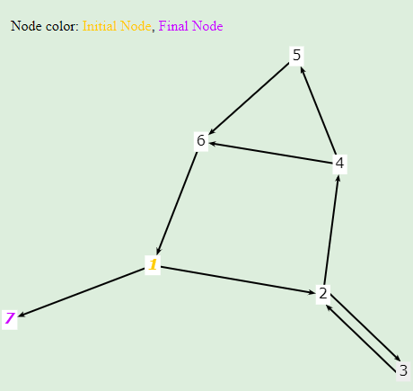

# Ex 7.2.2-5 #

(a)
 

(b) 12 requirements are needed for Edge-Pairs
1. [1,2,3]
2. [1,2,4]
3. [2,3,2]
4. [3,2,3]
5. [3,2,4]
6. [2,4,5]
7. [2,4,6]
8. [4,5,6]
9.  [4,6,1]
10. [5,6,1]
11. [6,1,2]
12. [6,1,7]

(c) The test p1 satisfy Edge-Pair Coverage.
Test path p2 must be [1,2,4,5,6,1,2,4,5,6,1,7].
Test path p3 must be [1,2,4,6,1,2,3,2,3,2,4,6,1,7].

(d) The path [3,2,4,5,6] tour the path [1,2,3,2,4,6,1,2,4,5,6,1,7] with sidestrip [4,5,6].

(e) TRNC: [1],[2],[7],[3],[4],[5],[6]

TREC: [1,2],[1,7],[2,3],[3,2],[2,4],[4,5],[4,6],[5,6],[6,1]

TRPPC: [3,2,4,5,6,1,7],[2,3,2],[2,4,5,6,1,2],[1,2,4,5,6,1],[3,2,4,6,1,7],[3,2,3]

(f) The path p3 achieve Node Coverage but not Edge Coverage on the graph. Because it not contain edge [4,6].

(g) The path p3 achieve Node Coverage but not Prime Path Coverage on the graph. Because it not contain path [].
